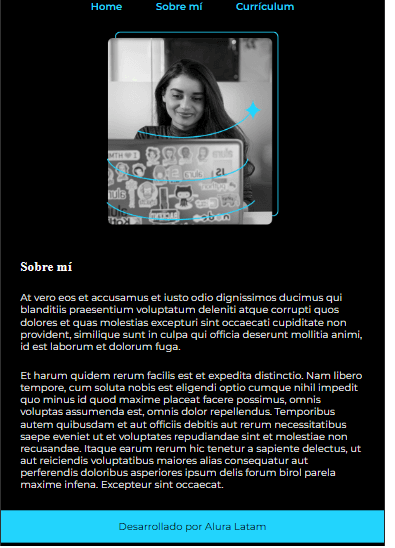
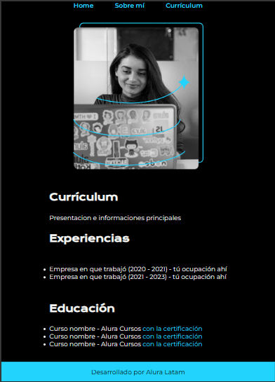

# 🌐 Portafolio Personal Proyecto

Bienvenido al portafolio, donde se muestran proyectos, experiencia y habilidades como desarrollador web.  

---

🔗 **Demo en línea:** [Ver Portafolio en Vercel](https://portafolio-jade-nine.vercel.app/)

---

## 🧐 Descripción

Este portafolio está diseñado para presentar mi trabajo en **HTML y CSS**, con un enfoque en un diseño **limpio, responsivo y profesional**, compatible con **móviles y tablets (Android y Apple)**.  

Incluye secciones como:  
- Página de inicio  
- Sobre mí  
- Curriculum  
- Contacto  

---

## 📸 Vista previa

 
  



<p align="center"> 
         
         
 </p>

---

## 🛠 Tecnologías utilizadas

- HTML5  
- CSS3  
- Carpetas de recursos (`assets`) para imágenes, íconos, etc.  
- Diseño responsivo para distintos dispositivos  

---

## 📁 Estructura del proyecto

Portafolio/
│── index.html
│── about.html
│── curriculum.html
│── styles/
│ └── (archivos CSS)
└── assets/
└── (imágenes, iconos, etc.)

---

## 🚀 Cómo ver el proyecto localmente

1. Clona este repositorio:

   ```bash
   git clone https://github.com/DepearLegendari/Portafolio.git
2. Entra a la carpeta
    cd Portafolio
3. Entra al archivo index.html en tu navegador. ousa el Live Server desde  el VSCode
# si usas VSCode 
    code .
# luego en VSCode: botón derecho sobre index.html → "Open with Live Server"

---

Características destacadas

✅ Diseño responsivo para móviles y tablets (Android & Apple)

✅ Secciones organizadas y fáciles de navegar

✅ Interfaz limpia y profesional

---

📬 Autor

Si quieres ponerte en contacto conmigo:

Nombre: Iván Eduardo Sánchez Matías

GitHub: [DepearLegendari](https://github.com/DepearLegendari)

LinkedIn: [ivan-e-s-matias-depearlegendari](https://www.linkedin.com/in/ivan-e-s-matias-depearlegendari?utm_source=share&utm_campaign=share_via&utm_content=profile&utm_medium=android_app)
